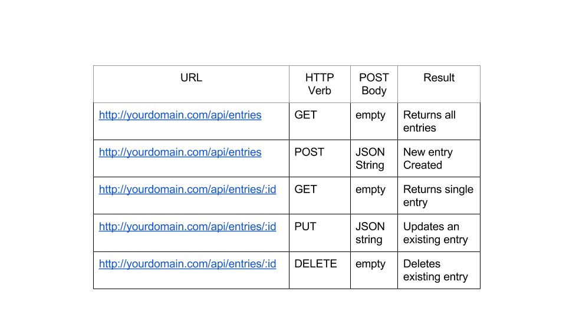

# becode-quotes-api

## Quotes API with ExpressJS and MongoDB

- Repository: `becode-quotes-api`
- Duration: 5 days
- Delivery style:
	- API hosted on heroku + database
- Team mode: yes
	- backend: 2 developers

	
### Objectives

- Understand what a RESTfull API is
- CRUD actions with MongoDB
- Create your own RESTfull API with ExpressJS and a database
- Host own API on Heroku

### What is CRUD

[CRUD](https://developer.mozilla.org/en-US/docs/Glossary/CRUD) stands for **C**reate **R**ead **U**pdate **D**elete. It is an abbreviation for the 4 most important actions you can perform with data in a database. 

#### REST

With expressJS we can develop our own API on a NodeJS server. When we develop an API we do so according to the [RESTful](https://restfulapi.net/) principle.

One particular resource from our database, e.g. *users*, will be represented by a URI.

```
website.com/api/users
```

When we perform a *request* to this API endpoint it will result in an action in the database. 

- A **GET** request to this URI will return a list of all users.
- A **POST** request to this URI will create a new user.

A well-developed REST API consists of clear URIs. For this it is important that the resources have a clear [naming](https://restfulapi.net/resource-naming/).



#### MongoDB

MongoDB is a widely used database with ExpressJS. To edit the data in this database you can also use [CRUD operations](https://docs.mongodb.com/manual/crud/).

If you prefer to use a MySQL database you can do so aswell. You can use [several different databases](https://expressjs.com/en/guide/database-integration.html) with ExpressJS.

### To Do

**!! Before you start creating your API** make sure you understand what the function is of every new technology you will use. Do so for the following technologies:
- [NodeJS](https://nodejs.org)
- [ExpressJS](https://expressjs.com/)
- Technologies for our database (e.g. MySQL, MongoDB (with mongoose)) 

If you feel like you understand what the function of each of thse new technologies is, it's time to use them to create something! Create a RESTful API that handles all of the CRUD actions for a quotes resource:

- Develop all necessary routes for your resource
	* A *GET* `/quotes` route that gives a list of all quotes
	* A *POST* `/quotes` route with which a quote can be added.
	* A *GET* `/quotes/{{quoteId}}}` route that gives a specific quote.
	* A *PUT* `/quotes/{{quoteId}}}` route that updates a specific quote.
	* A *DELETE* `/quotes/{{quoteId}}}` route that deletes a specific quote.

	 *(I use quotes as an example, you are free to choose something different, or add mulitple resources)*


### Bonus


- Host your API on Heroku
- Create a clear README with
	* Technologies used
	* Endpoints from your API

